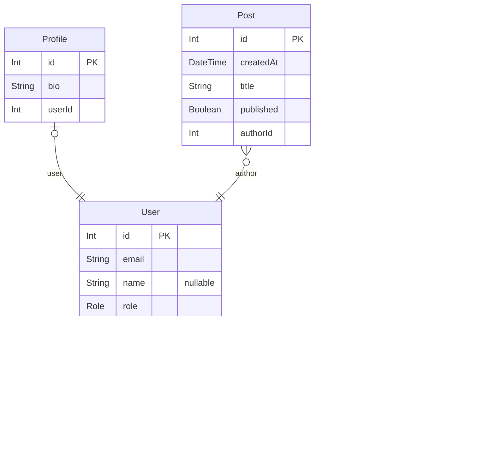

```mermaid
erDiagram

        Role {
            USER USER
ADMIN ADMIN
        }
    
  User {
    Int id PK 
    String email  
    String name  "nullable"
    Role role  
    }
  

  Profile {
    Int id PK 
    String bio  
    Int userId  
    }
  

  Post {
    Int id PK 
    DateTime createdAt  
    String title  
    Boolean published  
    Int authorId  
    }
  

  Category {
    Int id PK 
    String name  
    }
  
    User o|--|| Role : "enum:role"
    Profile o|--|| User : "user"
    Post o{--|| User : "author"
```
