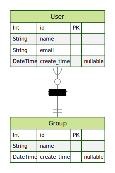

# hello-prisma

## Prisma example projects.

- [Prisma](https://www.prisma.io/)
- [Github](https://github.com/prisma/prisma)

### Usage

docker

```zsh
% docker-compose up -d
```

migration

```zsh
% yarn migrate
```

### Migration and Tests

1. migration

   ```zsh
   % yarn migrate
   yarn run v1.22.19
   $ prisma migrate dev --name init
   Environment variables loaded from .env
   Prisma schema loaded from prisma/schema.prisma
   Datasource "db": MySQL database "unadb" at "localhost:3306"

   Applying migration `20230312134815_init`
   Applying migration `20230312134952_init`

   The following migration(s) have been applied:

   migrations/
   └─ 20230312134815_init/
       └─ migration.sql
   └─ 20230312134952_init/
       └─ migration.sql

   Your database is now in sync with your schema.

   ✔ Generated Prisma Client (4.11.0 | library) to ./node_modules/@prisma/client in 84ms


   ✨  Done in 2.32s.
   ```

1. test

   ```zsh
   % yarn test
   yarn run v1.22.19
   $ ts-node src/index.ts
   [
     {
         id: 1,
         name: 'wojotfi.chanel',
         email: 'kivve@okofo.accountant',
         create_time: 2023-03-12T14:56:51.551Z
     },
     {
         id: 2,
         name: 'is.capital',
         email: 'jegcowwo@sedoad.like',
         create_time: 2023-03-12T14:56:51.951Z
     }
   ]
   ✨  Done in 1.91s.
   ```

### ERD


